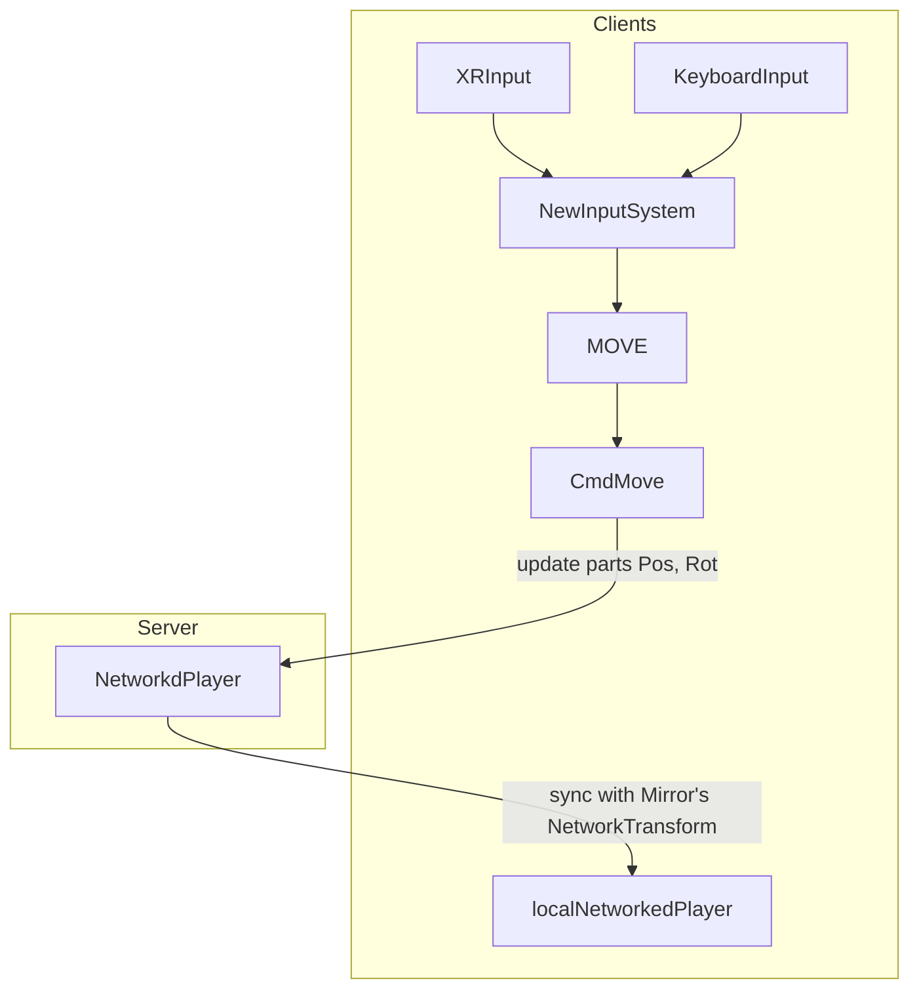

# XRInput send MOVE throught CmdMove()

# Execution Order in Mirror Networked

__No netId__ at ``Awake`` and ``OnEnable``

##### NetworkedPlayer Awake, OnEnable 
isLocalPlayer: $${\color{red}False}$$, isClient: $${\color{red}False}$$
isServer: $${\color{red}False}$$, isOwned: $${\color{red}False}$$

## HOST(Server+Client) 
__No netId__ at ``Awake``, ``OnEnable``,``OnDisable``,``OnDestroy``

### Local player, created by NetworkClient.AddPlayer()

##### NetworkedPlayer Start (ONLY timing seems show correct state
isLocalPlayer: $${\color{red}False}$$, isClient: $${\color{green}True}$$
isServer: $${\color{green}True}$$, isOwned: $${\color{green}True}$$

##### NetworkedPlayer OnDisable,  OnDestroy, NO netId at this moment
isLocalPlayer: $${\color{red}False}$$, isClient: $${\color{red}False}$$
isServer: $${\color{red}False}$$, isOwned: $${\color{red}False}$$

### Others player, created by NetworkClient.AddPlayer()

##### NetworkedPlayer Start (ONLY timing seems show correct state
isLocalPlayer: $${\color{red}False}$$, isClient: $${\color{green}True}$$
isServer: $${\color{green}True}$$, isOwned: $${\color{red}False}$$

##### NetworkedPlayer OnDisable,  OnDestroy, NO netId at this moment
isLocalPlayer: $${\color{red}False}$$, isClient: $${\color{red}False}$$
isServer: $${\color{red}False}$$, isOwned: $${\color{red}False}$$

## CLIENT 
__No netId__ at ``Awake``, ``OnEnable``

__HAS netId__ at ``OnDisable``,``OnDestroy``

### Local player, created by NetworkClient.AddPlayer()

##### NetworkedPlayer Start
isLocalPlayer: $${\color{red}False}$$, isClient: $${\color{green}True}$$
isServer: $${\color{red}False}$$, isOwned: $${\color{green}True}$$

##### NetworkedPlayer OnDisable, OnDestroy: HAS netId
isLocalPlayer: $${\color{red}False}$$, isClient: $${\color{green}True}$$
isServer: $${\color{red}False}$$, isOwned: $${\color{green}True}$$

### Other players, created by NetworkClient.AddPlayer()

##### NetworkedPlayer Start (ONLY timing seems show correct state
isLocalPlayer: $${\color{red}False}$$, isClient: $${\color{green}True}$$
isServer: $${\color{red}False}$$, isOwned: $${\color{red}False}$$

##### NetworkedPlayer OnDisable, OnDestroy : HAS netId
isLocalPlayer: $${\color{red}False}$$, isClient: $${\color{green}True}$$
isServer: $${\color{red}False}$$, isOwned: $${\color{red}False}$$
