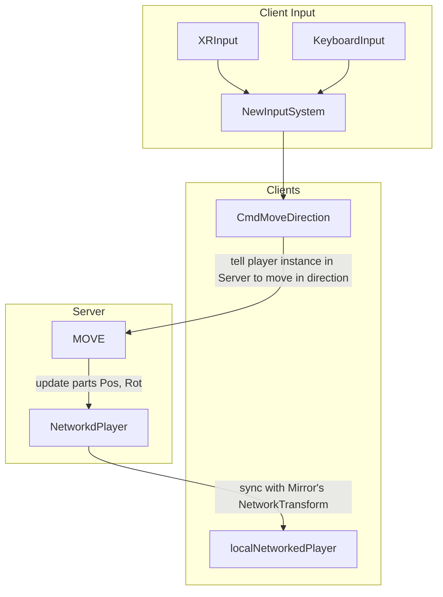
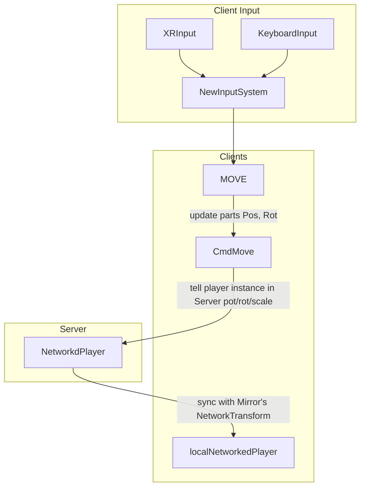
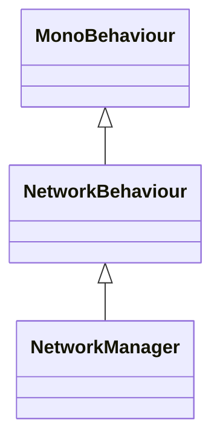

## General Architecture
* Unity 2022.3
* Meta XR Core - Oculus XR Plugin (NOT OpenXR, since it does not support Linux)
* Mirror - Linux server in Docker 

## XRInput send MOVE throught CmdMove()





## Execution Order in Mirror Networked



| Event                      | NetworkBehaviour  | NetworkManager  | 
|-----------------------------|---------------|----------|
| OnStartServer | Server | Server |
| OnStartHost | n/a | Host |
| OnServerConnect n/a | | |
| OnStartAuthority | Client | n/a |
| OnStartClient | Client | |
| OnClientConnect | n/a | |
| OnServerSceneChanged | n/a | Server |
| OnServerReady | n/a | |
| OnServerAddPlayer | n/a | |
| OnClientChangeScene | n/a | |
| OnClientSceneChanged | n/a | |

### Player instance ownership

Creating a player BY SERVER, OWNED by SERVER, isLocalPlayer always $${\color{red}FALSE}$$

 [NetworkClient.AddPlayer()](https://storage.googleapis.com/mirror-api-docs/html/df/d6f/class_mirror_1_1_network_client.html#abb593c6a35fa52633a8f0795b9aa74b7) 
```
Sends AddPlayer message to the server, indicating that we want to join the world.
```


__No netId__ at ``Awake`` and ``OnEnable``, hence NO events in these two states

| Event                      | isLocalPlayer | isClient | isServer | isOwned |
|-----------------------------|---------------|----------|----------|---------|
| **NetworkedPlayer Awake**    | False | False | False | False |
| **NetworkedPlayer OnEnable** | False | False | False | False |


### HOST(Server+Client) 
__No netId__ at ``Awake``, ``OnEnable``,``OnDisable``,``OnDestroy``

* NetworkedPlayer Start (ONLY timing seems show correct state
* NetworkedPlayer OnDisable,  OnDestroy, NO netId at this moment

#### Local player, created by NetworkClient.AddPlayer()

| Event                      | isLocalPlayer | isClient | isServer | isOwned |
|-----------------------------|---------------|----------|----------|---------|
| **NetworkedPlayer Start**    | $${\color{green}True}$$ | $${\color{green}True}$$ | $${\color{green}True}$$ | $${\color{green}True}$$ |
| **NetworkedPlayer OnDisable** | $${\color{red}False}$$ | $${\color{red}False}$$ | $${\color{red}False}$$ | $${\color{red}False}$$  |
| **NetworkedPlayer OnDestroy** | $${\color{red}False}$$ | $${\color{red}False}$$ | $${\color{red}False}$$ | $${\color{red}False}$$  |

#### Others' players, created by NetworkClient.AddPlayer()

| Event                      | isLocalPlayer | isClient | isServer | isOwned |
|-----------------------------|---------------|----------|----------|---------|
| **NetworkedPlayer Start**    | False         | False     | $${\color{green}True}$$ | False    |
| **NetworkedPlayer OnDisable** | False | False | False | False |
| **NetworkedPlayer OnDestroy** | False | False | False | False |

### CLIENT 
__No netId__ at ``Awake``, ``OnEnable``

__HAS netId__ at ``OnDisable``,``OnDestroy``

* NetworkedPlayer Start
* NetworkedPlayer OnDisable, OnDestroy: HAS netId
  
#### Local player, created by NetworkClient.AddPlayer()

| Event                      | isLocalPlayer | isClient | isServer | isOwned |
|-----------------------------|---------------|----------|----------|---------|
| **NetworkedPlayer Start**    | $${\color{green}True}$$ | $${\color{green}True}$$     | False     | $${\color{green}True}$$   |
| **NetworkedPlayer OnDisable** | $${\color{green}True}$$ | $${\color{green}True}$$     | False     | $${\color{green}True}$$   |
| **NetworkedPlayer OnDestroy** | $${\color{green}True}$$ | $${\color{green}True}$$     | False     | $${\color{green}True}$$   |

### Others' players, created by NetworkClient.AddPlayer()

| Event                      | isLocalPlayer | isClient | isServer | isOwned |
|-----------------------------|---------------|----------|----------|---------|
| **NetworkedPlayer Start**    | False         | $${\color{green}True}$$     | False     | False    |
| **NetworkedPlayer OnDisable** | False         | $${\color{green}True}$$     | False     | False    |
| **NetworkedPlayer OnDestroy** | False         | $${\color{green}True}$$     | False     | False    |

